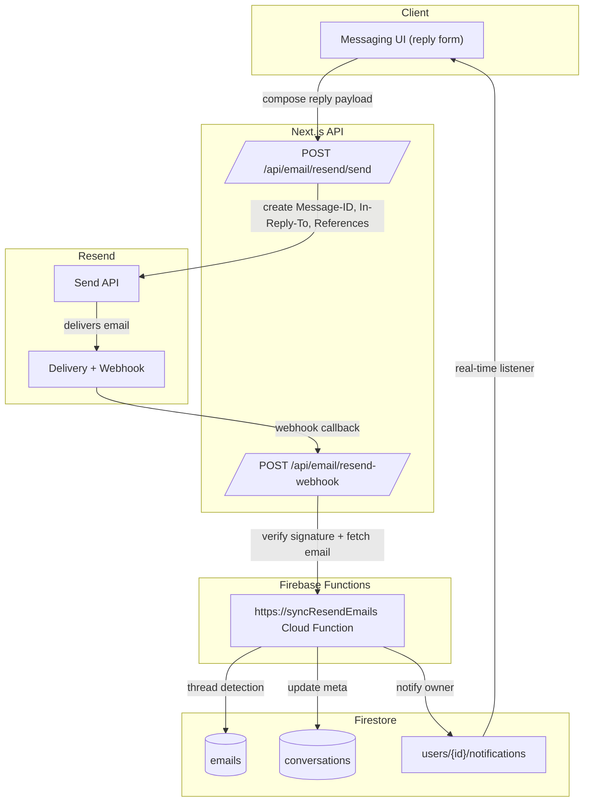

## Resend Integration Overview

We rely on [Resend](https://resend.com/) both for outbound email delivery and inbound webhook ingestion. The diagram below summarizes the full life-cycle of a message across our stack.

### Detailed Flow

1. **User action**  
   From the messaging UI a user drafts a message. When they submit, we call the Next.js route `POST /api/email/resend/send`.

2. **Send API (server)**  
   The send route validates the payload, generates RFC‑5322 threading headers (`Message-ID`, `In-Reply-To`, `References`), and calls `resend.emails.send(...)`. We persist the outbound metadata so that future replies can be matched.

3. **Delivery + webhook**  
   Resend sends the email to the recipient and, once a response is received (or any inbound email hits the inbox), Resend triggers our webhook endpoint `POST /api/email/resend-webhook/`. We verify the signature using `RESEND_WEBHOOK_SECRET`, fetch the email payload via the Resend Receiving API, and forward it to the Firebase HTTPS function `syncResendEmails`.

4. **Cloud processing**  
   `syncResendEmails` parses the message, runs through multiple threading strategies (In-Reply-To, References, subject+participants), stores the message in `emails`, updates/creates the `conversations` document, and creates a user-scoped notification document (`users/{userId}/notifications/{notificationId}`).

5. **Realtime updates**  
   Clients listening to the notifications path (and/or the conversations collection) immediately reflect the new message, so the UI can show banners such as “New email received – go to Messages”.

### Key Files

| Purpose | Path |
| --- | --- |
| Send email via Resend | `src/app/api/email/resend/send/route.ts` |
| Receive webhook, verify signature | `src/app/api/email/resend-webhook/route.ts` |
| Process inbound message, thread + store | `functions/src/emails/syncResendEmails.ts` |
| Resend helper utilities | `src/helpers/resend.ts` |

### Secrets

- `RESEND_API_KEY` and `RESEND_DOMAIN` are used server-side when sending email.
- `RESEND_WEBHOOK_SECRET` secures the webhook endpoint; we refuse requests when verification fails.
- These secrets must **not** be prefixed with `NEXT_PUBLIC_` to avoid leaking them to the browser.

