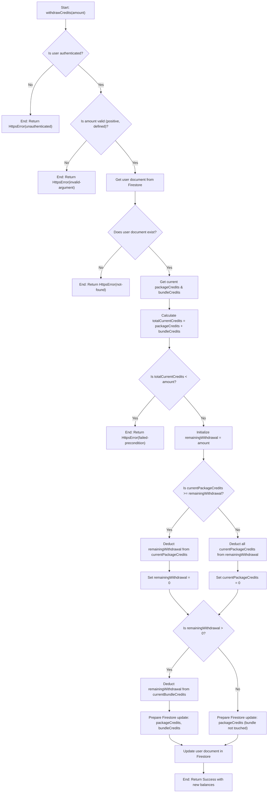

# Credits Flow

Here's the logic for the `withdrawCredits` function:

```mermaid
graph TD
    A["Start: withdrawCredits(amount)"] --> B{"Is user authenticated?"}

    B -- No --> B_Err["End: Return HttpsError(unauthenticated)"]
    B -- Yes --> C{"Is amount valid (positive, defined)?"}

    C -- No --> C_Err["End: Return HttpsError(invalid-argument)"]
    C -- Yes --> D["Get user document from Firestore"]

    D --> E{"Does user document exist?"}

    E -- No --> E_Err["End: Return HttpsError(not-found)"]
    E -- Yes --> F["Get current packageCredits & bundleCredits"]

    F --> G["Calculate totalCurrentCredits = packageCredits + bundleCredits"]

    G --> H{"Is totalCurrentCredits < amount?"}

    H -- Yes --> H_Err["End: Return HttpsError(failed-precondition)"]
    H -- No --> I["Initialize remainingWithdrawal = amount"]

    I --> J{"Is currentPackageCredits >= remainingWithdrawal?"}

    J -- Yes --> K["Deduct remainingWithdrawal from currentPackageCredits"]
    K --> L["Set remainingWithdrawal = 0"]
    L --> N

    J -- No --> M["Deduct all currentPackageCredits from remainingWithdrawal"]
    M --> M_prime["Set currentPackageCredits = 0"]
    M_prime --> N

    N{"Is remainingWithdrawal > 0?"}

    N -- Yes --> O["Deduct remainingWithdrawal from currentBundleCredits"]
    O --> P["Prepare Firestore update: packageCredits, bundleCredits"]
    P --> Q["Update user document in Firestore"]

    N -- No --> P_prime["Prepare Firestore update: packageCredits (bundle not touched)"]
    P_prime --> Q

    Q --> R["End: Return Success with new balances"]


```

