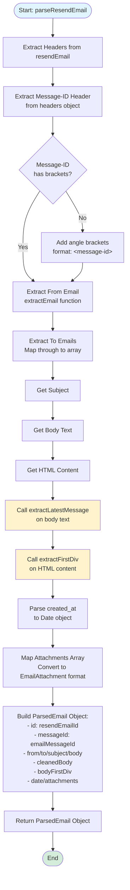
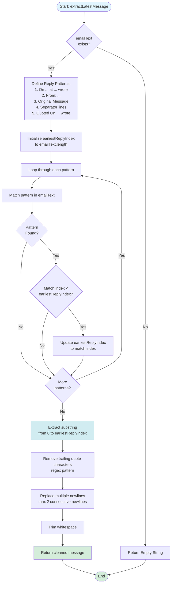
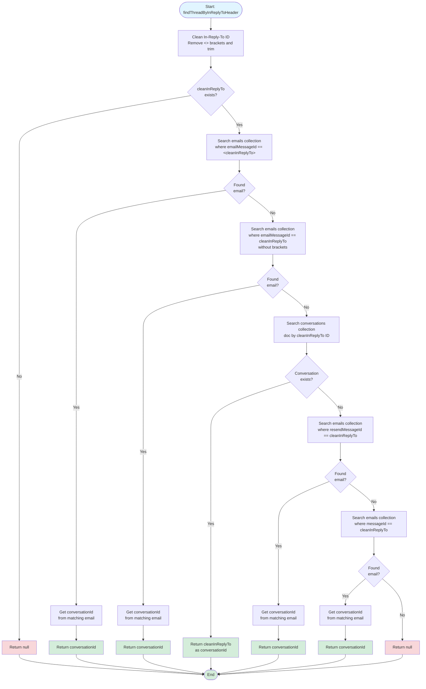
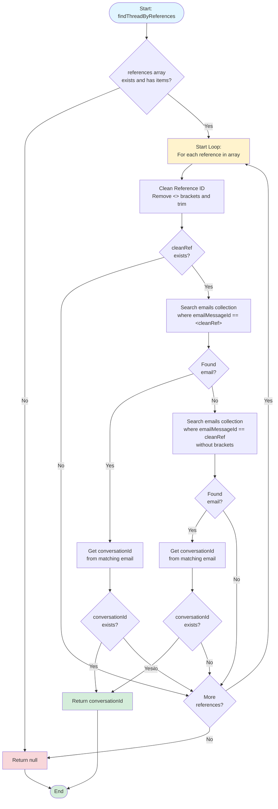
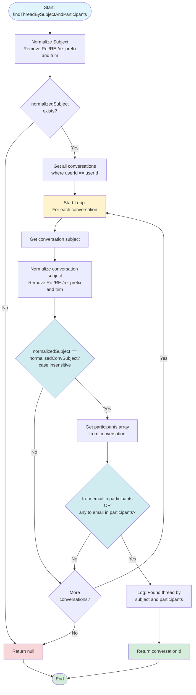

# Sync Resend Emails Flow

```mermaid
flowchart TD
    Start([Webhook Received]) --> ValidateRequest{Validate Request Body}
    ValidateRequest -->|Missing emailData/resendEmailId| Error1[Return 400 Error]
    ValidateRequest -->|Valid| ParseEmail[Parse Resend Email]
    
    ParseEmail --> ExtractHeaders[Extract Headers:<br/>- Message-ID<br/>- In-Reply-To<br/>- References]
    ExtractHeaders --> ExtractContent[Extract Content:<br/>- From/To emails<br/>- Subject<br/>- Body text/HTML]
    ExtractContent --> CleanBody[Clean Body:<br/>extractLatestMessage<br/>Remove quoted content]
    CleanBody --> ExtractFirstDiv[Extract First Div from HTML]
    ExtractFirstDiv --> ParsedEmail{Parsed Successfully?}
    
    ParsedEmail -->|No| Error2[Return 400 Error]
    ParsedEmail -->|Yes| FindUser[Find User by Recipient Email<br/>Search users.resendEmail]
    
    FindUser --> UserFound{User Found?}
    UserFound -->|No| Error3[Return 404 Error]
    UserFound -->|Yes| CheckInReplyTo{In-Reply-To<br/>Header Exists?}
    
    CheckInReplyTo -->|Yes| Strategy1[Strategy 1: Find by In-Reply-To]
    Strategy1 --> SearchEmailMessageId[Search emails.emailMessageId<br/>with brackets]
    SearchEmailMessageId --> Found1{Found?}
    Found1 -->|Yes| SetConversationId1[Set conversationId]
    Found1 -->|No| SearchEmailMessageId2[Search emails.emailMessageId<br/>without brackets]
    SearchEmailMessageId2 --> Found2{Found?}
    Found2 -->|Yes| SetConversationId1
    Found2 -->|No| SearchConversationId[Search conversations.doc<br/>by conversationId]
    SearchConversationId --> Found3{Found?}
    Found3 -->|Yes| SetConversationId1
    Found3 -->|No| SearchResendMessageId[Search emails.resendMessageId]
    SearchResendMessageId --> Found4{Found?}
    Found4 -->|Yes| SetConversationId1
    Found4 -->|No| SearchMessageId[Search emails.messageId]
    SearchMessageId --> Found5{Found?}
    Found5 -->|Yes| SetConversationId1
    Found5 -->|No| CheckReferences{References<br/>Header Exists?}
    
    CheckInReplyTo -->|No| CheckReferences
    SetConversationId1 --> CheckConversationId{conversationId<br/>Found?}
    
    CheckReferences -->|Yes| Strategy2[Strategy 2: Find by References]
    Strategy2 --> ParseReferences[Parse References Header<br/>JSON array or space/comma separated]
    ParseReferences --> LoopReferences[Loop through each Reference ID]
    LoopReferences --> SearchRefEmailMessageId[Search emails.emailMessageId<br/>for each reference]
    SearchRefEmailMessageId --> FoundRef{Found?}
    FoundRef -->|Yes| SetConversationId2[Set conversationId]
    FoundRef -->|No| MoreReferences{More References?}
    MoreReferences -->|Yes| LoopReferences
    MoreReferences -->|No| CheckSubject{Subject<br/>Exists?}
    
    CheckConversationId -->|Yes| UpdateConversation
    CheckConversationId -->|No| CheckReferences
    SetConversationId2 --> CheckConversationId
    
    CheckSubject -->|Yes| Strategy3[Strategy 3: Find by Subject + Participants]
    Strategy3 --> NormalizeSubject[Normalize Subject<br/>Remove Re: prefix]
    NormalizeSubject --> GetUserConversations[Get all conversations<br/>for userId]
    GetUserConversations --> LoopConversations[Loop through conversations]
    LoopConversations --> MatchSubject{Subject Matches?}
    MatchSubject -->|Yes| CheckParticipants{Participants<br/>Overlap?}
    MatchSubject -->|No| MoreConversations{More Conversations?}
    CheckParticipants -->|Yes| SetConversationId3[Set conversationId]
    CheckParticipants -->|No| MoreConversations
    MoreConversations -->|Yes| LoopConversations
    MoreConversations -->|No| CreateNewConversation
    
    CheckSubject -->|No| CreateNewConversation[Create New Conversation<br/>conversationId = resendEmailId]
    
    CreateNewConversation --> SetNewConversation[Set conversation document:<br/>- participants<br/>- subject<br/>- unreadCount: 1<br/>- labels: INBOX]
    
    UpdateConversation[Update Existing Conversation] --> MergeParticipants[Merge participants]
    MergeParticipants --> UpdateFields[Update:<br/>- lastMessage<br/>- lastMessagePreview<br/>- unreadCount++<br/>- participants]
    
    SetNewConversation --> StoreEmail
    UpdateFields --> StoreEmail[Store Email Document]
    
    StoreEmail --> SetEmailFields[Set email fields:<br/>- userId<br/>- resendMessageId<br/>- conversationId<br/>- emailMessageId<br/>- from/to/subject/body<br/>- cleanedBody<br/>- attachments<br/>- labels: INBOX]
    
    SetEmailFields --> Success[Return 200 Success<br/>with emailId and conversationId]
    
    Error1 --> End([End])
    Error2 --> End
    Error3 --> End
    Success --> End
    
    style Start fill:#e1f5ff
    style Success fill:#d4edda
    style Error1 fill:#f8d7da
    style Error2 fill:#f8d7da
    style Error3 fill:#f8d7da
    style Strategy1 fill:#fff3cd
    style Strategy2 fill:#fff3cd
    style Strategy3 fill:#fff3cd
    style CreateNewConversation fill:#d1ecf1
    style UpdateConversation fill:#d1ecf1
```

## Helper Functions Flow

### parseResendEmail()

### extractLatestMessage()

### findThreadByInReplyToHeader()

### findThreadByReferences()

### findThreadBySubjectAndParticipants()

